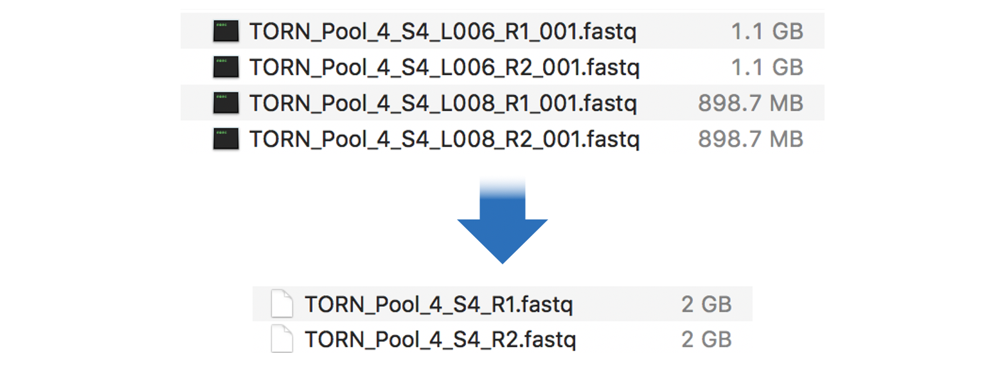

# Exon-capture Assembly Pipeline

##### Tornabene Lab of Systematics and Biodiversity

Author: Calder Atta
        University of Washington
        School of Aquatic and Fisheries Science
        calderatta@gmail.com

Based on reference: Yuan H, Atta C, Tornabene L, Li C. (2019) Assexon: Assembling Exon Using Gene Capture Data. Evolutionary Bioinformatics 15: 1–13. doi.org/10.1177/1176934319874792.

Created: February 12, 2020

Last modified: May 10, 2020

***
## Introduction
 This pipeline is meant to guide the user to process their raw exon-capture data. See installation guide if any programs are not installed or you run into errors not described below. This pipeline is based on the Assexon method described in the above reference.

## Overview
I. Setup and Raw Data
II. Merge Lanes
III. Trim Adapters
IV. Assemble
V. Filter Data Set
VI. Aligning
VII. Alignment Filtering
VIII. Summary Statistics
IX. Concatenated RAxML Method
X. Gene Trees ASTRAL Method
XI. Finding Contaminated Samples
XII. Removing Contaminated Samples
XIII. Select Clocklike Genes
XIV. Generate Time-calibrated Tree
***

## I. Setup and Raw Data

##### 1. Setup
Create a home directory for your analysis somewhere accessible but with amble storage. About 1TB is recommended but you can store smaller files locally and only process large files using a supercompter. It may help to have your name or initials in the title if working in a shared computer (eg. `CA_exon_capture`).

Create a folder in your home directoty for your raw data. Eg. `raw`.

Tip: There are a lot of steps in this pipeline, so in order to keep your data organized, it can help to add a numeral prefix before each folder so each step appears in order. Eg. `0_raw`. You can also have `~supp` folders containing supplamentary files produced by analysis that are not the actual sequence data. Below is an example of the full naming scheme used in a previous analysis:

CA_exon_capture/
- 0_raw
- 1_merge
- 2_trim
- 2_trim_supp
- 3_assemble_result
- 3_assemble_result_supp
- 4_nf_rm_poor
- 4_nf_aligned
- 4_nf_filtered
- 4_nf_filtered_supp
- 4_concat
- 4_raxml_tree
- 4_detect_contam
- 5_rm_contam
- 5_nf_aligned
- 5_nf_filtered
- 5_nf_filtered_supp
- 5_concat
- 5_raxml_tree
- 6_nf_filtered_ml
- 6_genetrees.tre
- 6_astral_tree.tre

The above scheme is only an example. If you want to change the names of folders, just make sure to specify the name you want in the input and output options for each step.

##### 2. Download and Unzip Data
Download data and move into your `raw` folder. If the data are downloaded as a compressed packedged, you will need to extract this first. Inside, you should find your data as compressed Fasta files in .gz format. To incompress, run the following command in each folder containing .fastq files:

    gunzip -k *.fastq.gz

You should have 2 files for each sample (or more if you ran samples more than once) in the format below:
`sample_name_S##_L###_R1_001.fastq`
`sample_name_S##_L###_R2_001.fastq`

- R# refers to forward (R1) and reverse (R2). You should have one file for each direction per sample run on one lane.
- S## is a unique ID number given by the sequencing process to each sample.
- L### refers to lane number. If your samples were run twice (on two different lanes) then you will have 4 files per sample - R1 and R2 for two different name numbers. In this case you will need to do the merge step below.

## II. Merge Lanes
*** SKIP THIS STEP if samples were only run once! ***

##### 1. Check lane number
Find the lane number in the fastq file names. For example, `L001` in `_L001_R1_001.fastq`. If different runs use the same lane number, you will need to rename the files of the runs temporarily. Merging requires files to be in the same directory, so they must have different names. Also, the merge command in step 3 needs to identify different lane numbers in the file name. If the numbers are different, skip this step.

To rename the lane numbers of all fastq files in one directory from `L001` to `L002` run:

    rename 's/_L001/_L002/' *.fastq

Note: If you sumbitted more than one pool, you will need to do this more than once and with unique lane numbers for each run and each pool.

##### 2. Move all .fastq files into one folder
This can be one of the original raw data folders or you can copy all files into a new folder if you want to preserve the original files and have amble strage space.

##### 3. Merge files
To merge files with lane numbers `L001` and `L002` run:

    (for i in *_L001_R1_001.fastq; do cat ${i%_L001_R1_001.fastq}_L001_R1_001.fastq ${i%_L001_R1_001.fastq}_L002_R1_001.fastq > ${i%_L001_R1_001.fastq}_R1.fastq; done)
    (for i in *_L001_R2_001.fastq; do cat ${i%_L001_R2_001.fastq}_L001_R2_001.fastq ${i%_L001_R2_001.fastq}_L002_R2_001.fastq > ${i%_L001_R2_001.fastq}_R2.fastq; done)

The first 2 commands merge the lanes for R1 and R2 files respectively for the 1st run. The latter 2 commands do the same for the 2nd run. Change the lane numbers to match your own samples.

##### 4. Move merged files into merge folder
Move to a new `merge` directory. You can make the file and click-and-drag or use the following code:

    mkdir ../1_merge
    mv *_R1.fastq ../1_merge/

Now, there should be one R1 and R2 per sample as such:
`sample_name_R2.fastq`
`sample_name_R2.fastq`

##### 5. (Optional) Return original files to their respective folders and restore lane names

***
## Assembly
***

## III. Trim Adapters

##### 1. Rename merged files as .fq
The input files for `trim_adaptor.pl` must be .fq, NOT .fastq, so in `merge` (or `raw` if there was no merge step) run:

    (for file in *.fastq; do mv "$file" "$(basename "$file" .fastq).fq"; done)

Output:
`sample_name_R2.fq`
`sample_name_R2.fq`

##### 2. Trim adapters
*** Best to run on a supercomputer (see instructions on using HYAK/MOX) ***

Check the options for `trim_adaptor.pl` by adding the help flag `-h` and to make sure the script works. You should do this for all of the custom perl scripts (.pl files) going forward.

    trim_adaptor.pl -h

In your home directory run the following:

    trim_adaptor.pl \
    --raw_reads input \
    --trimmed output

Example:

    trim_adaptor.pl --raw_reads 1_merge --trimmed 2_trimmed

The output will be in the directory `trimmed`. This will also produce report files `trimmed_reads_bases_count.txt` and `trimming_report/sample_name_trimming_report.txt`. To clean these file up into a new directory `trimmed_supp` run:

    mkdir 2_trimmed_supp
    mv trimmed_reads_bases_count.txt 2_trimmed_supp/
    mv trimming_report 2_trimmed_supp/

## IV. Assemble
*** MUST run on a supercomputer (see instructions on using HYAK/MOX) ***

##### Test to make sure all dependencies are present and working

The `assemble.pl` script is a "wrapper" script that executes several other scripts in the pipeline. The 6 scripts included represent 6 steps of assembly.

- `rmdup.pl` (Remove PCR duplication)
- `ubxandp.pl` (Parse reads to loci)
- `sga_assemble.pl` (Assemble parsed reads)
- `exonerate_best.pl` (Filter unqualified assemblies and find assemblies can be further assembled)
- `merge.pl` (Assemble contigs further and retrieve best contigs for each locus)
- `reblast.pl` (Remove potential paralogs)

You can use a special flag to make sure all the required programs are installed correctly.

    assemble.pl -check_depends

If all dependencies are properly installed, you will see the following text in STDOUT:

>Currently used interpreter is "/XXX/perl"
>
>Version of your perl interpreter (/XXX/perl) is v5.24
>
>All modules are properly installed
>
>All softwares are properly installed
>
>All scripts are found under $PATH

Deterining orthology between a reference and your enriched sequence is based on whether they can be aligned to same position on the genome of reference species. Thus, existence of reference must be checked to avoid false negative detection of orthology due to missing targeted loci. To check the existence of reference sequences in a given genome run:

  	assemble.pl \
  	--check_query \
  	--queryn /path/to/reference/dna/sequence.dna.fas \
  	--db /path/to/reference/genome/sequence.genome.fas \
  	--dbtype nucleo

Example:

    assemble.pl --check_query --queryn /home/users/cli/ocean/reference_and_genome/Oreochromis_niloticus.dna.fas --db /home/users/cli/ocean/reference_and_genome/Oreochromis_niloticus.genome.fas --dbtype nucleo

If input genome is in Fasta format, a corresponding UDB database will be generated. If input database is in udb format, then no file will be generated. You will see the following text in STDOUT in both case:

>Start constructing ublast database in parallel
>Something generated by usearch...
>Ublast database has been constructed
>Something generated by usearch...
>#### All genes are found in provided database ####

If some genes do not exist in given genome, STDOUT will be:

>#### 2 genes below are not found in provided database  ####
>Danio_rerio.1.46410167.46410317
>Danio_rerio.14.21871634.21871111

##### Run the entire assembly pipeline

If all requirements are verified above, we can run `assemble.pl` as a job on a supercomputer with the trimmed reads as the input:

    assemble.pl \
    --trimmed input \
    --queryp /path/to/reference/animo_acid/sequence.aa.fas \
    --queryn /path/to/reference/dna/sequence.dna.fas \
    --db /path/to/reference/genome.sm_genome.fa \
    --dbtype nucleo \
    --ref_name reference \
    --outdir output

Involved options:

--trimmed: Directory containing reads without adaptor and low quality bases
--queryp: Amino acid sequences of target loci in fasta format 
--queryn: Nucleotide sequences of target loci in fasta format 
--db: Path to DNA or amino acid database, either in fasta or udb format
--dbtype: Database type either 'nucleo' for DNA or 'prot' for amino acid database
--ref_name: Substitute name of target loci as --ref_name in the output of last step (reblast.pl), disabled in default
--outdir: Directory to pipeline output

Example:

    assemble.pl \
    --trimmed 2_trimmed \
    --queryp /home/users/cli/ocean/reference_and_genome/Oreochromis_niloticus_17675/Oreochromis_niloticus_4434.aa.fas \
    --queryn /home/users/cli/ocean/reference_and_genome/Oreochromis_niloticus_17675/Oreochromis_niloticus_4434.dna.fas \
    --db /home/users/cli/ocean/reference_and_genome/Oreochromis_niloticus_17675/Oreochromis_niloticus.sm_genome.fa \
    --dbtype nucleo \
    --ref_name Oreochromis_niloticus \
    --outdir 3_assemble_result

Expect this to run for about a week. A previous run of 130 samples (130GB) was about 6 days. If the run fails part of the way through, you can re-run starting from the last step. See below for running a partial pipeline or use `assemble.pl -h` to see other options.

Inside your output folder `3_assemble_result` you will have one file for each marker, within each is one sequence per sample. Data is organized into 3 folders:  
- `nf`: coding nucleotide sequences  
- `f`: coding sequences with flanking regions  
- `p`: amino acid sequences

Several other folders and files will be generated during the execution:  
-`run_dir`: All intermediate outputs will be generated under this folder.  
-`samplelist.txt`: A list includes name of all samples  
-`rmdup_reads_bases_count.txt`: A table records number of reads and bases before and after removing PCR duplicates  
-`enriched_loci.txt`: A table records number of total loci, number of enriched loci and percentage of enriched loci for each sample  
-`Oreochromis_niloticus.genome.fas.udb`: UDB of "Oreochromis_niloticus.genome.fas". This can be used as input database.

To clean up supplamentary files into `3_assemble_result_supp` run:

    mkdir 3_assemble_result_supp
    mv enriched_gene.txt 3_assemble_result_supp/
    mv failed_hit.txt 3_assemble_result_supp/
    mv rmdup_reads_bases_count.txt 3_assemble_result_supp/
    mv samplelist.txt 3_assemble_result_supp/
    mv run_dir 3_assemble_result_supp/

*** *THE LIST OF SUPPLAMENTARY DATA AND COMMANDS DO NOT MATCH - NEED TO CHECK* ***

##### Cleaning the intermediate input (optional)

Intermediate outputs under `run_dir` will occupy lot of memory. Remove `run_dir` and all files under it by:

    assemble.pl --clean

##### Running only part of the assembly pipeline (optional)

If something goes wrong at the intermediate step, don't worry, `assemble.pl` is able to restart
from intermediate step. It can also stop at the step you want.

To restart from intermediate step, 4 things are essentially needed:  
1) Output from previous one step  
2) Essential options for the following step  
3) Options for restart or stop  
4) sample list

1) Intermediate output from each step  
Step 1: `rmdup.pl`: ./run_dir/rmdup  
Step 2: `ubxandp.pl`: ./run_dir/parsed  
Step 3: `sga_assemble.pl`: ./run_dir/assembled  
Step 4: `exonerate_best.pl`: ./run_dir/filtered  
Step 5: `merge.pl`: ./run_dir/merged  
Step 6: `reblast.pl`: ./run_dir/reblastout

2) Essential options for each step  
Step 1: `rmdup.pl`: --trimmed  
Step 2: `ubxandp.pl`: --queryp  
Step 3: `sga_assemble.pl`: nothing  
Step 4: `exonerate_best.pl`: --queryp  
Step 5: `merge.pl`: --queryp and --queryn  
Step 6: `reblast.pl`: --db, --dbtype, --ref_name and --outdir

3) Option for restart or stop at a step  
To restart from a step: `--restart_from_xxx`  
To stop at a step: `--stop_after_xxx`

Examples:  
To restart from step 4 (`exonerate_best.pl`):`--restart_from_exonerate_best`  
To stop at step 5 (`merge.pl`). The option is:`--stop_after_merge`

I want restart from step 4 and stop at step 5, then specify 2 options: `--restart_from_exonerate_best --stop_after_merge`

4) Sample list  
Sample list is named `samplelist.txt` as the default. It contains the list of sample names, one sample name per line. It is automatically generated from first step.

Here are 3 examples of running partial pipeline:

EXAMPLE 1: From an intermediate step to the end (`exonerate_best.pl` -> end)

We need:  
1) Output from previous step `sga_assemble.pl` (./run_dir/assembled)  
2) Essential inputs of `exonerate_best.pl` (--queryp), `merge.pl` (--queryn, --queryp) and `reblast.pl` (--db, --dbtype, --ref_name, --outdir)  
3) samplelist.txt  
4) option "--restart_from_exonerate_best"  
so the command is:  

  	assemble.pl \
  	--queryp Oreochromis_niloticus.aa.fas \
  	--queryn Oreochromis_niloticus.dna.fas \
  	--db Oreochromis_niloticus.genome.fas \
  	--dbtype nucleo \
  	--outdir assemble_result \
  	--ref_name Oreochromis_niloticus \
  	--samplelist samplelist.txt \
  	--restart_from_exonerate_best

EXAMPLE 2: Restart from an intermediate step to another intermediate step (`sga_assemble.pl` -> `merge.pl`)

We need:  
1) output from previous one step `ubxandp.pl` (./run_dir/parsed)  
2) Essential inputs of `sga_assemble.pl` (nothing), `exonerate_best.pl` (--queryp) and `merge.pl` (--queryn, --queryp)  
3) samplelist.txt  
4) 2 options "--restart_from_sga_assemble" as well as "--stop_after_merge"  
command:  

  	assemble.pl \
  	--queryp Oreochromis_niloticus.aa.fas \
  	--queryn Oreochromis_niloticus.dna.fas \
  	--samplelist samplelist.txt \
  	--restart_from_sga_assemble \
  	--stop_after_merge

EXAMPLE 3: Stop at an intermediate step (start -> `sga_assemble.pl`)

We start from the first step, so there's no input from previous one step. We just need:

1) Essential inputs of `rmdup.pl` (--trimmed), `ubxandp.pl` (--queryp), and `sga_assemble.pl` (nothing)  
2) samplelist.txt  
3) option "--stop_after_sga_assemble"  
command:

    assemble.pl \
  	--trimmed trimmed \
  	--queryp Oreochromis_niloticus.aa.fas \
  	--samplelist samplelist.txt \
  	--stop_after_sga_assemble`

##### Run the assembly pipeline with a subset of your samples (optional)

If you run into problems with specific samples, you can rerun those samples without needing to rerun everything. This also works for running a partial pipeline as described above. Samples listed in `samplelist.txt` will be the ones used by `assemble.pl`, so you can customize the `samplelist.txt` list to only include the samples you want to be assembled.

Then just specify the new sample list file after the option "--samplelist". Example if text file is `samplelist.txt`:

  	assemble.pl \
  	--trimmed trimmed \
  	--queryp Oreochromis_niloticus.aa.fas \
  	--queryn Oreochromis_niloticus.dna.fas \
  	--db Oreochromis_niloticus.genome.fas \
  	--dbtype nucleo \
  	--outdir assemble_result \
  	--ref_name Oreochromis_niloticus \
  	--samplelist samplelist.txt

***
## Post-processing
***

## V. Filter Data Set
Before aligning, remove...
(1) Samples represented by fewer than 500 genes
(2) Genes captured in fewer then 70% of the samples

These values can be adjusted if you want to retain more/fewer genes or samples. These are based on data from Calder Atta flatfish data (2019). See below for graph showing how many genes are retained (y-axis) when those with fewer than x number of genes are removed (70% of 122 samples = 85 --> about 3000 genes retained).

##### 1. Check genes counts per sample
Open and check in `assemble_result_supp/enriched_gene.txt`.

##### 2. Check sample counts per gene
Add sequences from `assemble_result/nf` into Geneious (as lists) and check/sort by sequence counts.

If any genes (files) contain fewer than 70% of the samples, we need to remove them.

Alternatively, you can navigate to the `assemble_result/nf` and report sequence counts for each file, but this is not the easiest method.

    grep -c "^>" *.fas

##### 2. Removing genes with a < 70% completeness level and samples with < 500 genes.
At this point there is one file for each gene, and each file contains one sequence per samples + the reference (eg. Oreochromis_niloticus). So we need to filter out the files with fewer sequences than 70% of the total taxa.

Total Samples = n
70% of Samples = x = n * 0.7

Run `pick_taxa.pl` using the non-flanking (nf) region files replacing x with the number calculated (rounding down to the nearest integer) and a list of all taxa that need to be removed separated by spaces:

    pick_taxa.pl \
    --indir input \
    --outdir output \
    --min_seq x \
    --deselected_taxa 'sample1 sample2 sample3'

Example:

    pick_taxa.pl --indir 3_assemble_result/nf --outdir 4_nf_rm_poor --min_seq 86 --deselected_taxa 'HIPELAS_UW151449_S68 LEPPOLY_UW150842_S37 ATHEVER_DY167195_S103 ATHSTOM_UW047693_S34 HIPELAS_UW154480_S73'

## VI. Aligning
Run `mafft_aln.pl` on the filtered dataset to align sample sequences for each gene:

    mafft_aln.pl \
    --dna_unaligned input \
    --dna_aligned output \
    --cpu 12

Example:

    mafft_aln.pl --dna_unaligned 4_nf_rm_poor --dna_aligned 4_nf_aligned --cpu 12

Note: Use `--cpu 2` if your computer only has 2 processors.

## VII. Alignment Filtering
Run `filter.pl` on the aligned dataset to remove poorly aligned loci:

    filter.pl \
    --indir input \
    --filtered output \
    --ref_taxa reference \
    --cpu 12

Example:

    filter.pl --indir 4_nf_aligned --filtered 4_nf_filtered --ref_taxa "Oreochromis_niloticus" --cpu 12

This will also produce the file `nf_filtered.numofgenescaptured.txt`. To clean up run:

    mkdir 4_nf_filtered_supp
    mv nf_filtered.numofgenescaptured.txt 4_nf_filtered_supp/

## VIII. Summary Statistics
You can check a variety of information using `statistics.pl` on the filtered alignments with flanking region data:

    statistics.pl \
    --nf_aligned filtered_alignments \
    --f flanking_regions

Example:

    statistics.pl --nf_aligned 4_nf_filtered --f 3_assemble_result/f

***
## Contstructing Trees
***

At this point you will have a dataset that is ready to used for phylogenetic analysis. This guide will show two methods for constructing a species tree (phylogeny where each branch tip is a sample).

1. Concatinated: Filter alignments -> Concatenated master gene (concat_loci.pl) -> RAxML
2. Gene Trees: Filter alignments -> Gene trees (construct_tree.pl) -> ASTRAL

## IX. Concatenated RAxML Method
Concatenated trees attempt to reflect the true evolutionary history of species by weighting each gene by its size so each base pair is treated equally. We use raxml to reconstruct concatenated trees.

[Citation] A. Stamatakis: "RAxML Version 8: A tool for Phylogenetic Analysis and Post-Analysis of Large Phylogenies". Bioinformatics (2014) 30 (9): 1312-1313.

##### 1. Concatinate all genes into one master gene
Using `concat_loci.pl`, concatinate all loci (files) into one master gene sequence per sample.

    concat_loci.pl \
    --indir input \
    --outfile output

Example:

    concat_loci.pl --indir 4_nf_filtered --outfile 4_concat

Three files will be produced: `4_concat.fas` `4_concat.nex` `4_concat.phy`

##### 2. Run RAxML analysis  

Use `raxmlHPC-PTHREADS-SSE3` and the following options to construct a maximum likelihood phylogeny.

Options:
- -s = input phylogeny file
- -T = number of nodes
- -# = number of alternative runs on distinct starting trees (bootstrap iterations)
- -p = parsimony random seed number
- -x = bootstrap random seed number
- -m = substitution model (options GTRCAT and GTRGAMMA) (GTRGAMMA is faster on datasets with more than 50 samples)
- -n = output tree name
- -f = a rapid Bootstrap analysis and search for best scoring ML tree in one program run
- -y = optional quartet groupings

Example:

    raxmlHPC-PTHREADS-SSE3 -T 12 -n 4_raxml -y -f a -# 100 -p 12345 -x 12345 -m GTRCAT -s 4_concat.phy

This will produce 5 tree files that you can check in a visulization software like FigTree:
`RAxML_bestTree.4_raxml`
`RAxML_bipartitions.4_raxml` This one contains bootstrap support values.
`RAxML_bipartitionsBranchLabels.4_raxml`
`RAxML_bootstrap.4_raxml`
`RAxML_info.4_raxml`

## X. Gene Trees ASTRAL Method
The second method is to first produce one tree for each gene, then merge these into one species tree. "Gene" trees represent the evolutionary history of the genes
included in the study. Gene trees can provide evidence for gene duplication events, as
well as speciation events. Sequences from different homologs can be included in a gene
tree; the subsequent analyses should cluster orthologs, thus demonstrating the evolutionary history of the orthologs.

ASTRAL is a tool for estimating an unrooted species tree given a set of unrooted gene trees. It is statistically consistent under the multi species coalescent model. ASTRAL finds the species tree that has the maximum number of shared induced quartet trees with the set of gene trees, subject to the constraint that the set of bipartitions in the species tree comes from a predefined set of bipartitions.

##### 1. Construct gene tree for each loci (construct.pl)

    construct_tree.pl --indir 4_nf_filtered --cpu 4

This will create the output directory `4_nf_filtered_ml/` with one tree file per gene.

Potential Problem:
If running this script gives an error similar to the one below, you might need to make a copy of your `nf_filtered` directory wherever it seems to be looking. I had to make a new directory called `Calder` in `Dropbox` as well in order for this to work. Make sure to move `8_nf_filtered` out of `Dropbox` and remove the copied `nf_filtered` from whereever you put it. I have yet to find a better solution.

>sh: line 0: cd: /Users/calderatta/Dropbox/Calder/: No such file or directory
>sh: line 0: cd: /Users/calderatta/Dropbox/Calder/: No such file or directory
>
>ERROR: Cannot find input directory "/Users/calderatta/Dropbox/Calder/8_nf_filtered", please check --indir (No such file or directory)

##### 2. Merge resulting gene trees into one file

Navigate into the gene tree folder (eg. `4_nf_filtered_ml`) and merge them into a single multi-tree file. Example:

    cat 4_nf_filtered_ml/*.tre > 4_genetrees.tre

##### 3. Construct species tree in ASTRAL

Using `java`, run ASTRAL on the multi-tree file.

Options:
- -jar = version of astral
- -i = input file
- -o = output file

Example:

    java –jar astral.5.6.3.jar –i 4_genetrees.tre –o 4_astral_tree.tre

We can use a mapping file to force all individuals to map together using -a. (https://github.com/smirarab/ASTRAL/blob/master/astral-tutorial.md#astral-help)

***
## Contamination
***

## XI. Finding Contaminated Samples

##### 1. Create a text file `same.txt` with groupings of closely related samples on each line.
This is fairly subjective, but make groups that you would strongly expect to have more similar DNA than to anything outside the group.
Example:

##### 2. Compare groupings to data.
Run `detect_contamination.pl` on the filtered alignments using `same.txt` to check if clearly unrealated samples are too genetically similar. Example:

    detect_contamination.pl --indir 4_nf_filtered --same same.txt

This will produce the file `contamination_stat.txt` which shows the likelyhood of each sample contaminating another (contamination rate) given your groupings.

##### 3. Examine your phylogeny and identify samples that are clearly not the right place.
While making a list of samples that are potentially contaminated, check for high contamination rates in `contamination_stat.txt` to verify contamination. Keep in mind some samples may simply be poor quality and/or be in a position that has not been seen in previous phgylogenies.

## XII. Removing Contaminated Samples

##### 1. Remove contaminated samples using and do steps V - VIII again using `pick_taxa.pl`.

***
## Additional Phylogenetic Analyses
***

## XIII. Select Clocklike Genes
Workflow: Filter alignments + RAxML tree -> Filter clocklike

##### 1. Run clocklikeness test on filtered alignments

    clocklikeness_test.pl --indir 4_nf_filtered --besttree RAxML_bestTree.4_raxml.tre --clocklike 5_clocklike_dir --cpu 4

This  produces a folder `clocklikeness_dir` with filtered genes based on p-values, but do not use these as the filter is very aggresive. Examine `likelihood.txt` locally in excel.

Be sure to run the RAxML file `RAxML_bestTree.*****`. I was not able to get this to run with the astral tree.

##### 2. Select clocklike genes to filter
In `likelihood.txt`, first check if the likelihood ratio (MCL) and sequence length correlate. If so, make a corrected MCL by dividing the ratio by length and filter for the lowest values. Then determine a minimum value threshhold for genes to keep based, this number is subjective, but about 500 genes is good. Also consider keeping genes that are longer.

Make a list of genes to keep `clocklike_genes.txt`.

##### 3. Filter for selected genes

    mkdir 5_clocklike_genes
    rsync -a 4_nf_filtered --files-from=clocklike_genes.txt 5_clocklike_genes

This command only keeps files in the above text file (copies from previous directory).

## XIV. Generate Time-calibrated Tree
If we ran this directly only on the the filtered alignments dataset or even the clocklike dataset, Beast would need to consider lengths as well as all possible topologies, so to reduce the computational workload, we can use the ASTRAL tree as a topology constraint.

Workflow: Time-calibrated tree: Filter clocklike + Species tree + Fossils -> Time-calibrated tree

*** *THIS SECTION NEEDS TO BE UPDATED* ***
