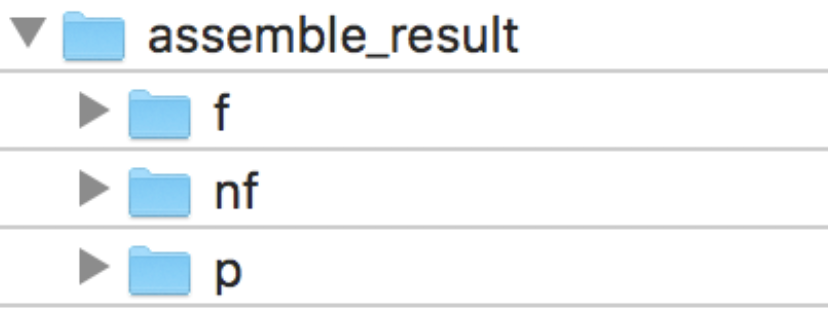
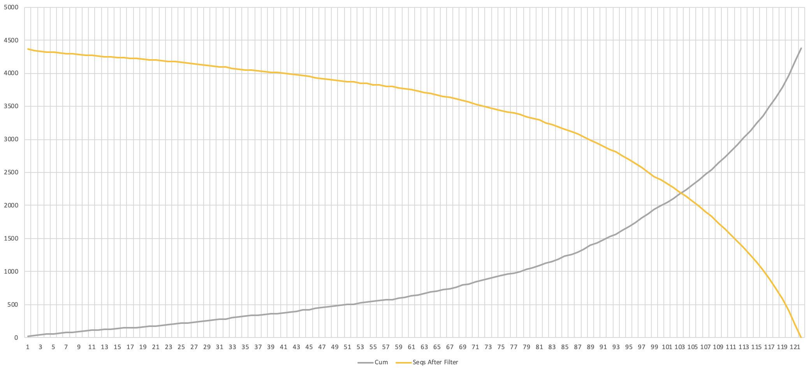
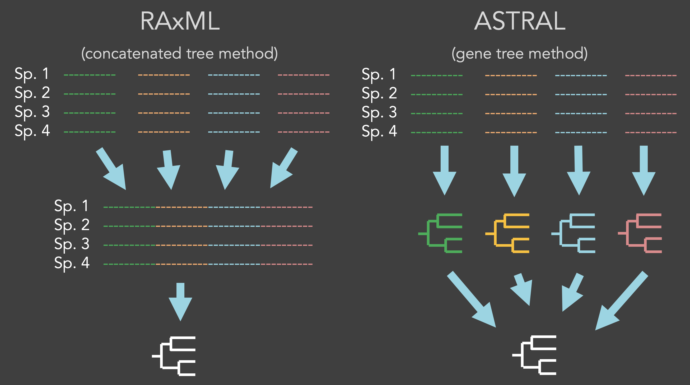
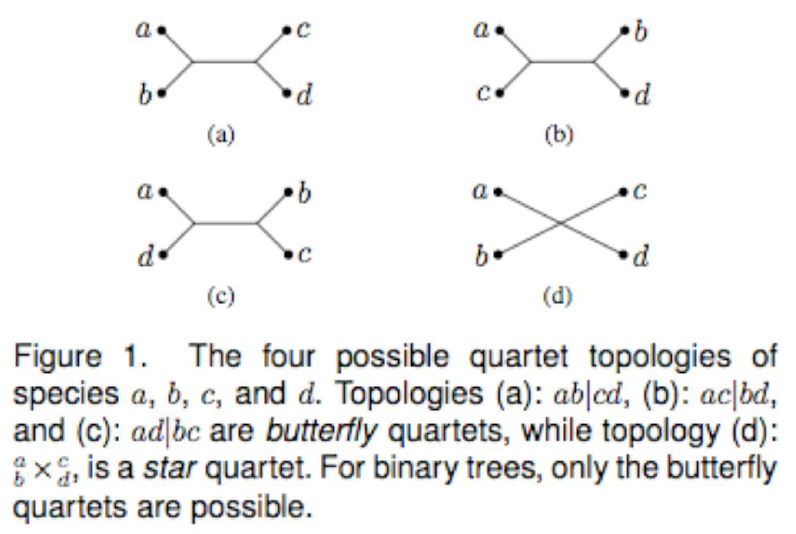
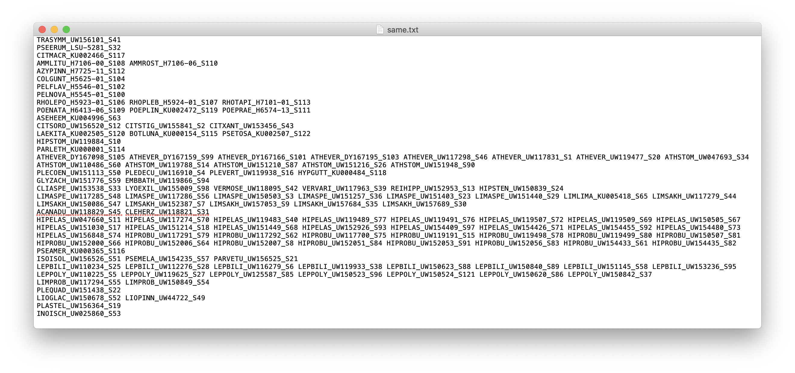

# Exon-capture Pipeline

##### Tornabene Lab of Systematics and Biodiversity

Author: Calder Atta  
        University of Washington  
        School of Aquatic and Fisheriese Science  
        calderatta@gmail.com

Created: February 12, 2020

Last modified: ~

***
## Introduction
 This pipeline is meant to guide the user to process their raw exon-capture data processing. See installation guide if any programs are not installed.

## Overview
I. Setup and Raw Data  
II. Merge Lanes  
III. Trim Adapters  
IV. Assemble  
V. Filter Data Set  
VI. Aligning  
VII. Alignment Filtering  
VIII. Summary Statistics  
IX. Concatenated RAxML Method  
X. Gene Trees ASTRAL Method  
XI. Finding Contaminated Samples  
XII. Removing Contaminated Samples  
XIII. Select Clocklike Genes  
XIV. Generate Time-calibrated Tree
***

## I. Setup and Raw Data  

##### 1. Setup home directory
Create a home directory for your analysis. It may help to have your name or initials in the title if working in a shared computer (eg. `CA_exon_capture`).

##### 1. Download 
Download raw files to a directory `raw-data`.

##### 2. Unzip

##### 3. Unzip individual .fastq files
In each folder containing .fastq files run the following command:

    gunzip -k *.fastq.gz

You should have 2 files for each sample - one for forward reads (R1), and one for reverse reads (R2.). Example:  
`sample_name_L001_R1.fastq`  
`sample_name_L001_R2.fastq`

## II. Merge Lanes
*** SKIP THIS STEP if samples were only run once! ***  

##### 1. Check lane number
Find the lane number in the fastq file names. For example, `L001` in `_L001_R1_001.fastq`. If different runs use the same lane number, you will need to rename the files of the runs temporarily. Merging requires files to be in the same directory, so they must have different names. Also, the merge command in step 3 needs to identify different lane numbers in the file name. If the numbers are different, skip this step.

To rename the lane numbers of all fastq files in one directory from `L001` to `L002` run:

    rename 's/_L001/_L002/' *.fastq

Note: If you sumbitted more than one pool, you will need to do this more than once and with unique lane numbers for each run and each pool.

##### 2. Move all .fastq files into one folder

##### 3. Merge files
To merge files with lane numbers `L001` and `L002` run:

    (for i in *_L001_R1_001.fastq; do cat ${i%_L001_R1_001.fastq}_L001_R1_001.fastq ${i%_L001_R1_001.fastq}_L002_R1_001.fastq > ${i%_L001_R1_001.fastq}_R1.fastq; done)
    (for i in *_L001_R2_001.fastq; do cat ${i%_L001_R2_001.fastq}_L001_R2_001.fastq ${i%_L001_R2_001.fastq}_L002_R2_001.fastq > ${i%_L001_R2_001.fastq}_R2.fastq; done)

The first 2 commands merge the lanes for R1 and R2 files respectively for the 1st run. The latter 2 commands do the same for the 2nd run. Change the lane numbers to match your own samples.

##### 4. Move merged files into merge folder
Move to `merge`.

##### 5. (Optional) Return original files to their respective folders and restore lane names

***
## Assembly
***

## III. Trim Adapters

##### 1. Rename merged files as .fq
In `merge` run:

    (for file in *.fastq; do mv "$file" "$(basename "$file" .fastq).fq"; done)

##### 2. Trim adapters
*** Best to run on a supercomputer (see instructions on using HYAK/MOX) ***  

Check the options for `trim_adaptor.pl` and to make sure the script works. You should do this for all of the custom perl scripts going forward.

    trim_adaptor.pl -h

In your home directory run the following:

    trim_adaptor.pl \
    --raw_reads merge \
    --trimmed trimmed

The output will be in the directory `trimmed`. This will also produce report files `trimmed_reads_bases_count.txt` and `trimming_report/sample_name_trimming_report.txt`. To clean these file up into a new directory `trimmed_supp` run:

    mkdir trimmed_supp
    mv trimmed_reads_bases_count.txt trimmed_supp/
    mv trimming_report trimmed_supp/

## IV. Assemble
*** MUST run on a supercomputer ***  

##### 1. Assemble
Run the following code as a job named `#PBS -N CA_assemble`:

    assemble.pl \
    --trimmed trimmed \
    --queryp /home/users/cli/ocean/reference_and_genome/Oreochromis_niloticus_17675/Oreochromis_niloticus_4434.aa.fas \
    --queryn /home/users/cli/ocean/reference_and_genome/Oreochromis_niloticus_17675/Oreochromis_niloticus_4434.dna.fas \
    --db /home/users/cli/ocean/reference_and_genome/Oreochromis_niloticus_17675/Oreochromis_niloticus.sm_genome.fa \
    --dbtype nucleo \
    --ref_name Oreochromis_niloticus \
    --outdir assemble_result
    
If the run fails part of the way through, you can re-run starting from the last step. See `assemble.pl -h` for how to run from a part-way through the process.

Full runtime for 130 samples (130GB) was about 6 days.

At the end you will have one file for each marker, within each is one sequence per sample. Data is organized by coding region (`asseemble_result/nf`), flanking region (`asseemble_result/f`), and amino acid (`asseemble_result/p`).

To clean up supplamentary files into `assemble_result_supp` run:

    mkdir assemble_result_supp
    mv enriched_gene.txt assemble_result_supp/
    mv failed_hit.txt assemble_result_supp/
    mv rmdup_reads_bases_count.txt assemble_result_supp/  
    mv samplelist.txt assemble_result_supp/
    mv run_dir assemble_result_supp/
    
***
## Post-processing
***

## V. Filter Data Set
Before aligning, remove...  
(1) Samples represented by fewer than 500 genes  
(2) Genes captured in fewer then 70% of the samples

These values can be adjusted if you want to retain more/fewer genes or samples. These are based on data from Calder Atta flatfish data (2019). See below for graph showing how many genes are retained (y-axis) when those with fewer than x number of genes are removed (70% of 122 samples = 85 --> about 3000 genes retained).

##### 1. Check genes counts per sample
Open and check in `assemble_result_supp/enriched_gene.txt`.

##### 2. Check sample counts per gene
Add sequences from `assemble_result/nf` into Geneious (as lists) and check/sort by sequence counts.

If any genes (files) contain fewer than 70% of the samples, we need to remove them.

Alternatively, you can navigate to the `assemble_result/nf` and report sequence counts for each file, but this is not the easiest method.

    grep -c "^>" *.fas

##### 2. Removing genes with a < 70% completeness level and samples with < 500 genes.
At this point there is one file for each gene, and each file contains one sequence per samples + the reference (eg. Oreochromis_niloticus). So we need to filter out the files with fewer sequences than 70% of the total taxa.

Total Samples = n  
70% of Samples = x = n * 0.7 

Run the following replacing x with the number calculated (rounding down to the nearest integer) and a list of all taxa that need to be removed separated by spaces:

    pick_taxa.pl \
    --indir assemble_result/nf \
    --outdir nf_rm_poor \
    --min_seq x \
    --deselected_taxa 'sample1 sample2 sample3'

## VI. Aligning
Run the following:

    mafft_aln.pl \
    --dna_unaligned nf_rm_poor \
    --dna_aligned nf_aligned \
    --cpu 12

Note: Use `--cpu 2` if your computer only has 2 processors.

## VII. Alignment Filtering
Run the following:

    filter.pl \
    --indir nf_aligned \
    --filtered nf_filtered \
    --ref_taxa "Oreochromis_niloticus" \
    --cpu 12

## VIII. Summary Statistics
Run the following:

    statistics.pl \
    --nf_aligned nf_filtered \
    --f assemble_result/f

***
## Contstructing Trees
***

At this point you will have a dataset that is ready to used for phylogenetic analysis. This guide will show two methods for constructing a species tree (phylogeny where each branch tip is a sample).

1. Concatinated: Filter alignments -> Concatenated master gene (concat_loci.pl) -> RAxML
2. Gene Trees: Filter alignments -> Gene trees (construct_tree.pl) -> ASTRAL

## IX. Concatenated RAxML Method
Concatenated trees attempt to reflect the true evolutionary history of species by weighting each gene by its size so each base pair is treated equally. We use raxml to reconstruct concatenated trees.

[Citation] A. Stamatakis: "RAxML Version 8: A tool for Phylogenetic Analysis and Post-Analysis of Large Phylogenies". Bioinformatics (2014) 30 (9): 1312-1313.

##### 1. Concatinate all genes into one master gene
This will concatinate all loci (files) into one master gene sequence per sample.

    concat_loci.pl \
    --indir nf_filtered \
    --outfile concat

Three files will be produced: 

##### 2. Run RAxML analysis  

    raxmlHPC-PTHREADS-SSE3 -T 12 -n raxml -y -f a -# 100 -p 12345 -x 12345 -m GTRCAT -s concat.phy

Options:
- -T = number of nodes
- -# = number of alternative runs on distinct starting trees (bootstrap iterations)
- -p = parsimony random seed number
- -m = substitution model (options GTRCAT and GTRGAMMA)
- -n = output file name
- -f = a rapid Bootstrap analysis and search for best scoring ML tree in one program run

## X. Gene Trees ASTRAL Method
The second method is to first produce one tree for each gene, then merge these into one species tree. "Gene" trees represent the evolutionary history of the genes
included in the study. Gene trees can provide evidence for gene duplication events, as
well as speciation events. Sequences from different homologs can be included in a gene
tree; the subsequent analyses should cluster orthologs, thus demonstrating the evolutionary history of the orthologs.

ASTRAL is a tool for estimating an unrooted species tree given a set of unrooted gene trees. It is statistically consistent under the multi species coalescent model. ASTRAL finds the species tree that has the maximum number of shared induced quartet trees with the set of gene trees, subject to the constraint that the set of bipartitions in the species tree comes from a predefined set of bipartitions.

##### 1. Construct gene tree for each loci (construct.pl)

    construct_tree.pl --indir nf_filtered --cpu 4

Output files: `nf_filtered_ml`
        
##### 2. Merge resulting gene trees into one file

Navigate into `nf_filtered_ml`.

    cat nf_filtered_ml/*.tre > genetrees.tre

##### 3. Construct species tree in ASTRAL

    java –jar astral.5.6.3.jar –i genetrees.tre –o species.tre –t 2

Options:
- -jar = version of astral
- -a = species name
- -o = output file
- -t 2 = full annotation

We can use a mapping file to force all individuals to map together using -a. (https://github.com/smirarab/ASTRAL/blob/master/astral-tutorial.md#astral-help)

***
## Contamination
***

## XI. Finding Contaminated Samples

##### 1. Create a text file `same.txt` with groupings of closely related samples on each line.
This is fairly subjective, but make groups that you would strongly expect to have more similar DNA than to anything outside the group.
Example:

##### 2. Compare groupings to data.
Run the following command:

    detect_contamination.pl --indir nf_filtered --same same.txt

This will produce the file `contamination_stat.txt` which shows the likelyhood of each sample contaminating another (contamination rate) given your groupings.

##### 3. Examine your phylogeny and identify samples that are clearly not the right place.
While making a list of samples that are potentially contaminated, check for high contamination rates in `contamination_stat.txt` to verify contamination. Keep in mind some samples may simply be poor quality and/or be in a position that has not been seen in previous phgylogenies.

## XII. Removing Contaminated Samples

##### 1. Remove contaminated samples using and do steps V - VIII again using `pick_taxa.pl`.

***
## Additional Phylogenetic Analyses
***

## XIII. Select Clocklike Genes
Workflow: Filter alignments + RAxML tree -> Filter clocklike

##### 1. Run clocklikeness test on filtered alignments

    clocklikeness_test.pl --indir nf_filtered --besttree RAxML_bestTree.raxml.tre --clocklike clocklike_dir --cpu 4

This  produces a folder clocklikeness_dir with filtered genes based on p-values, but do not use these as the filter is very aggresive. Examine `likelihood.txt` locally in excel.

##### 2. Select clocklike genes to filter
In `likelihood.txt`, first check if the likelihood ratio (MCL) and sequence length correlate. If so, make a corrected MCL by dividing the ratio by length and filter for the lowest values. Then determine a minimum value threshhold for genes to keep based, this number is subjective, but about 500 genes is good. Also consider keeping genes that are longer.

Make a list of genes to keep `clocklike_genes.txt`.

##### 3. Filter for selected genes

    mkdir clocklike_genes
    rsync -a nf_filtered --files-from=clocklike_genes.txt clocklike_genes

This command only keeps files in the above text file (copies from previous directory).

## XIV. Generate Time-calibrated Tree
If we ran this directly only on the the filtered alignments dataset or even the clocklike dataset, Beast would need to consider lengths as well as all possible topologies, so to reduce the computational workload, we can use the ASTRAL tree as a topology constraint.

Workflow: Time-calibrated tree: Filter clocklike + Species tree + Fossils -> Time-calibrated tree                              

*** *THIS SECTION NEEDS TO BE UPDATED* ***
