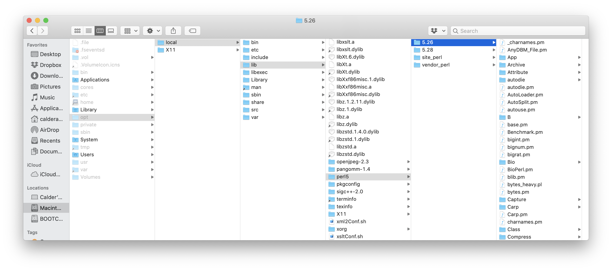

# Installation Guide for Exon Capture Data Processing

##### Tornabene Lab of Systematics and Biodiversity

Author: Calder Atta
        University of Washington
        School of Aquatic and Fisheriese Science
        calderatta@gmail.com

Created: February 12, 2020

Last modified: ~

This document is meant to have all instructions for software relating to the exon-capture piptline from scratch. If there are any errors running any of the scripts or other programs, solutions may be included here. Update as needed.

##### IMPORTANT: Most of these installations are much easier on a Mac than on Windows

## System Requirements

-	Perl v5.18 or higher
-	BioPerl v1.007001 of higher (used in mafft_aln.pl, filter.pl)
-	Perl modules
  - Bio::Seq (included in BioPerl) (used in assemble.pl, exonerate_best.pl, merge.pl)
  - Bio::AlignIO (included in Bioperl) (used in statistics.pl, detect_contamination.pl)
  - Bio::Align::DNAStatistics (included in Bioperl) (used in statistics.pl, detect_contamination.pl)
  - Parallel::Forkmanager (used in assemble.pl, rmdup.pl, ubxandp.pl, sga_assemble.pl, exonerate_best.pl, merge.pl, mafft_aln.pl, filter.pl)
  - Sys::Info (used in assemble.pl)
-	cutadapt v1.2.1 or higher (used in trim_adaptor.pl)
-	trim_galore v0.4.1 or higher (used in trim_adaptor.pl)
-	USEARCH 10.0.240 or higher (used in assemble.pl, rmdup.pl, ubxandp.pl, reblast.pl)
-	SGA v0.10.15 or higher (used in assemble.pl, sga_assemble.pl)
-	Exonerate v2.2.0 of higher (used in assemble.pl, exonerate_best.pl, merge.pl)
-	mafft v7.294b or higher (used in mafft_aln.pl, filter.pl)
-	raxmlHPC-SSE3 (construct_tree.pl)
-	paup 4.0a (build 161) or higher (used in clocklikeness_test.pl)

## Setting environmental variables ($PATH)

Before starting, you will need to understand environmental variables. These are locations on a computer that are automatically searched when entering text into the command line. Programs located in the $PATH can be called without typing out their entire path. There are several scripts and programs in this pipeline that are dependent on others and require them to be available in the $PATH. See below for how to check and add $PATH variables.

It might be helpful to store all programs associated with this pipeline in one place and add that location to the $PATH.

##### Windows
1. Right-click the Computer icon and choose Properties, or in Windows Control Panel, choose System.
2. Choose Advanced system settings. ...
3. On the Advanced tab, click Environment Variables. ...
4. Click New to create a new environment variable.

##### MAC
1. Open up Terminal.
2. Run the following command: `sudo nano /etc/paths`
3. Enter your password, when prompted.
4. Go to the bottom of the file, and enter the path you wish to add.
5. Hit control-x to quit.
6. Enter “Y” to save the modified buffer. Hit Enter.
7. That's it! To test it, in new terminal window, type: `echo $PATH`

## Important Locations to Know

These locations will vary from computer to computer. See the Perl section for information on @INC.

- @INC to perl modules (eg. /opt/local/lib/perl5/5.26/)
- $PATH to scripts and other dependencies (eg. /usr/local/bin/)
- Perl interpreter (eg. /opt/local/bin/perl)

## Installing Pipeline Scripts

The package of perl scripts used in this pipeline was taken from Yuan et al. (2019). Scripts (files with the .pl suffix) are located in `pipeline_scripts` and organized into 3 directories: `assemble`, `data_preparation`, `postprocess`.

To install the entire package, download the folder and move it to somewhere where you are going to keep all pipeline-related software. Then, you will need to add the 3 subdirectories to the $PATH (instructions above).

##### Tip: Rather then adding 3 new locations to the $PATH, it can be helpful to just create one directory containing all pipeline-related software and just move all executable programs into that one folder.
For example, you could create the folder `biotools` and add its location (eg. `/usr/local/bin/biotools/`) to the $PATH. Then just move any and all perl scripts that you want into that folder. You can then use the `biotools` folder for any other programs in this guide that you need to install.

## Perl

You must have Perl installed to use this pipeline. Mac computers come with Perl already installed. To test if Perl is installed run:

    perl --version

If you receve a message with the version, then perl is installed. If you get an error saying that perl cannot be found then you need to install it.

If perl gives you an error saying "Can't locate XXX in @INC" you may need to change the @INC array. @INC works like $PATH, but for Perl. See this page for help: perlmaven.com/how-to-change-inc-to-find-perl-modules-in-non-standard-locations

@INC on OVert computer:  
@INC = C:\Program Files\Git\
eg. @INC\usr\share\perl5\core_perl = C:\Program Files\Git\usr\share\perl5\core_perl

##### NOTE: This guide does not yet have information about installing Perl on other operationg systems.

## Perl Modules

Not all modules required for this pipeline are automatically installed with Perl. If you run a script and get an error like the one below, you will need to download additional modules from https://metacpan.org.

Example Error:
>Can't locate XXX.pm in @INC (you may need to install the XXX module) (@INC contains: /opt/local/lib/perl5/site_perl/5.26 /opt/local/lib/perl5/vendor_perl/5.26 /opt/local/lib/perl5/5.26) at /opt/local/lib/perl5/5.26/XXX.pm line XXX.

The following are modules that are known to be missing. Please add to this list if you find more. These modules are also stored on this repository.
- Parallel::ForkManager (https://metacpan.org/pod/Parallel::ForkManager)
- Moo (https://metacpan.org/pod/Moo)
- Sub::Quote (https://metacpan.org/pod/Sub::Quote)
- Bio::Seq (https://metacpan.org/pod/Bio::Seq)
- Statistics::Distributions (https://metacpan.org/release/Statistics-Distributions)
- Sys::Info (https://metacpan.org/pod/Sys::Info)
- Sys::Info::Constants (https://metacpan.org/pod/Sys::Info::Constants)

To install the modules, find the @INC directory that contains existing modules. It should be listed in the error (eg. /opt/local/lib/perl5/5.26/). Then just move the desired modules into this directory. If the required scripts are in folders, move the entire folder into the @INC directory. If the folder is already present, just add any of the missing files within the existing folder(s). The scripts should work on any operating system.

If you need to install modules from the website, seach for the module, download it, unzip it, and navigate into the unzipped folder. All the module files will be located in the `/lib/` folder. You may copy these files into the @INC directory as before or you can try running the following to automatically install.

    perl Makefile.PL && make test && make install

## Make scripts run without specifying "perl" in the command line

The command for running a perl script XXX.pl is `perl XXX.pl`, but we can modify the script so that it will run by just entering `XXX.pl`. The first line of each script (the "shebang") shows where the file is trying to locate the perl interpreter on the computer. As downloaded, the shebang is `#!opt/local/bin/perl`. If the `perl` is in a different location, you will need to correct the path in each perl script.

## Cutadapt
Link to download and install: https://github.com/marcelm/cutadapt

## Trimgalore
Link to download and install: https://github.com/FelixKrueger/TrimGalore

## USEARCH
Download link: https://www.drive5.com/usearch/download.html

Download the free 32-bit version for your computer and unzip it. Rename the binary file to just `usearch` and test it by navigating to it and calling the program in the command line: `./usearch`. Move the file to the $PATH. You may need to give permissions in order to execute it. To do so run: `chmod a+x usearch`

If you use a Mac 10.15 Catalina or higher, you cannot run the 32-bit version, so you will either need to purchase a license (which is VERY expensive) or run the rmdup.pl step on a different computer.

## SGA
Link to download and install: https://github.com/jts/sga

## Exonerate
Link to download and install: https://www.ebi.ac.uk/about/vertebrate-genomics/software/exonerate

## MAFFT
Link to download and install: https://mafft.cbrc.jp/alignment/software/

## RAxML
Link to download and install: https://github.com/stamatak/standard-RAxML

This one’s a little complicated. Check the README file before downloading to choose the right version. SSE3 will work on most newer computers and AVX for most recent (see read me for details), and PTHREADS is for running on any computer with more than one core processor (this should be almost all computers).

Download the repository from github, navigat einto the home folder and compile with the command for the right version. For most computers it’s:

    make -f Makefile.SSE3.PTHRADS.gcc

To call the program make sure to add a ./ if in a local directory (instead of from the path).

## PAUP

Link to download and install: http://phylosolutions.com/paup-test/

Download the binary version, then navigate to the file and expand with:

    gunzip paupa***

Rename the program just `paup` and move it to the $PATH. You will probably need to give permissions in order to execute this file. To do so run:

    chmod a+x paup

## ASTRAL (Optional)
Link to download and install: https://github.com/smirarab/ASTRAL

Installation instructions copied from GitHub site:

Download using one of two approaches:
1. You simply need to download the zip file and extract the contents to a folder of your choice.
2. Alternatively, you can clone the github repository. You then run make.sh to build the project or simply uncompress the zip file that is included with the repository.

ASTRAL is a java-based application, and should run in any environment (Windows, Linux, Mac, etc.) as long as java is installed. Java 1.5 or later is required. We have tested ASTRAL only on Linux and MAC. To test your installation, go to the place where you put the uncompressed ASTRAL, and run:

    java -jar astral.5.7.3.jar -i test_data/song_primates.424.gene.tre

Make sure to type which ever version you downloaded. This should quickly finish. There are also other sample input files under test_data/ that can be used.

ASTRAL can be run from any directory (e.g., /path/to/astral/). Then, you just need to run:

    java -jar /path/to/astral/astral.5.7.3.jar

Also, you can move astral.5.7.3.jar to any location you like and run it from there, but note that you need to move the lib directory with it as well.
