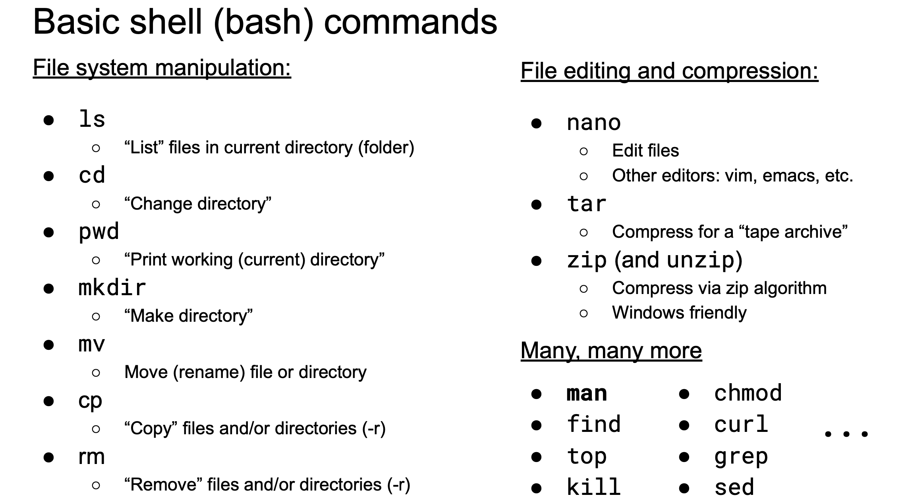
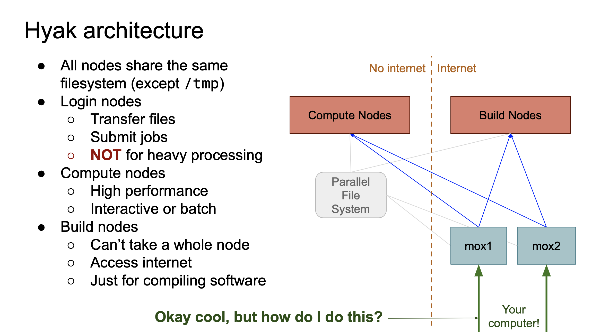
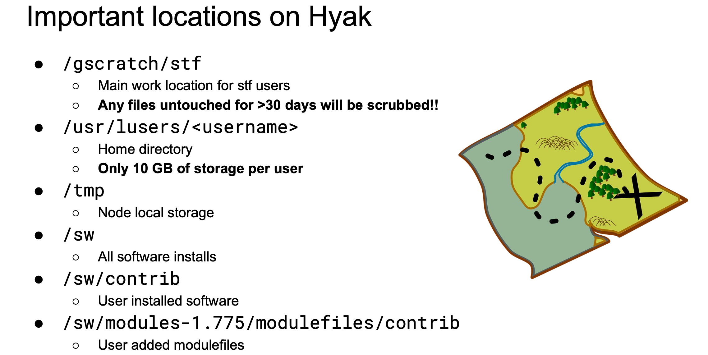
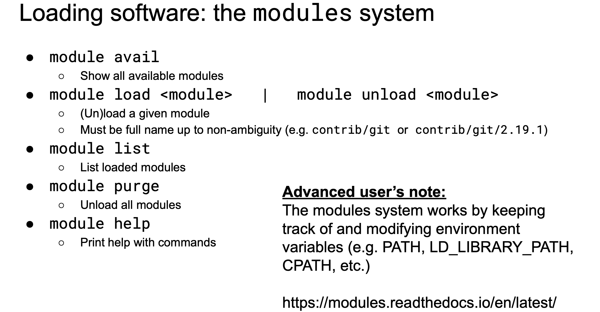
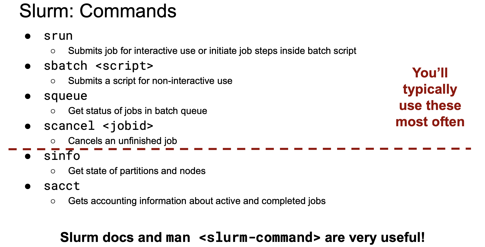
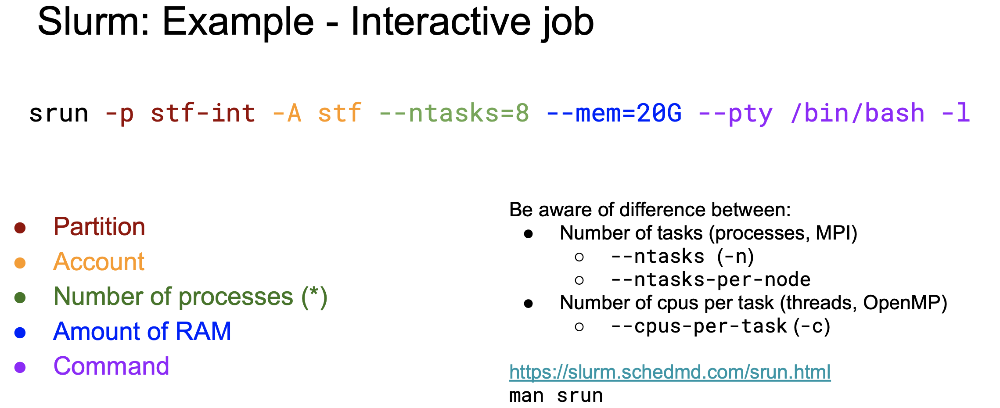
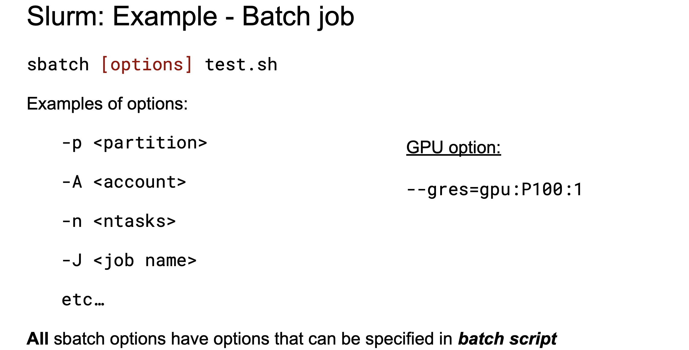
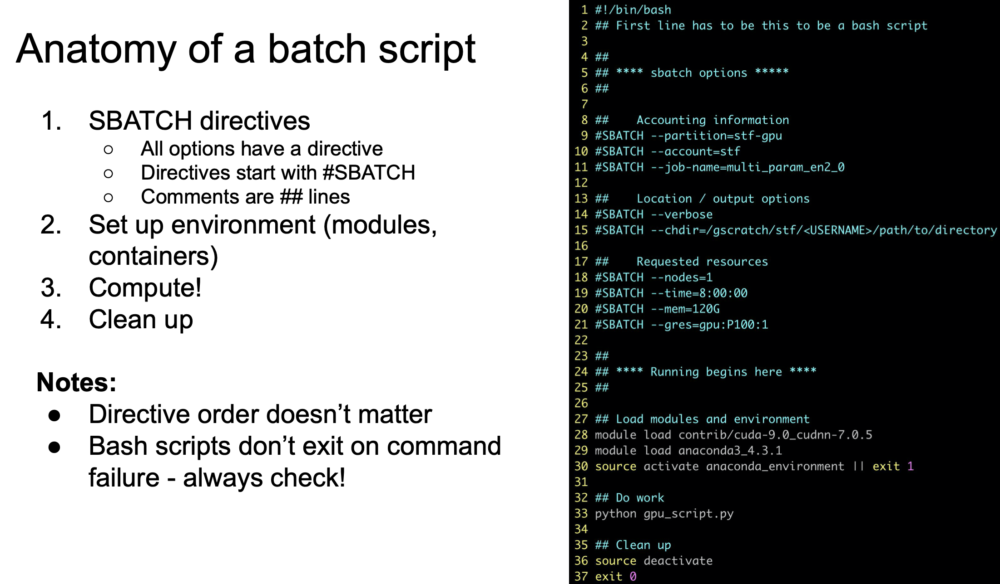

# Using MOX HYAK (UW super computer)

Author: Calder Atta  
        University of Washington  
        School of Aquatic and Fisheries Science  
        calderatta@gmail.com

Created: February 21, 2020

Last modified: ~

##### Description
Most of the information was taken from a "Hyak training session!" workshop run by the RCC.

##### Overview
- Resources
  - Research Computing Club (RCC)
  - Hyak Wiki
  - Steven Roberts Lab
- Understanding Supercomputing
  - Unix / Linux system and language
  - Parallel processing (Cores, Nodes, Threads, and CPUs)
- Using Mox Hyak
  - Logging In
  - Transfering Files
  - Loading Software
  - Custom $PATHs
  - Accessing the Computing Node (submitting jobs)
  - Example Job Script

***

### Resources

##### Research Computing Club (RCC)
The RCC is a resource for any UW student or postdoc looking to use Hyak. To use the cluster, you will neeed to register for the club and take an online quiz. Follow instructions here: https://depts.washington.edu/uwrcc/getting-started-2/.

The RCC offers workshops on using Hyak every quarter - typically one basic training and one more advanced training. Sign up for the listserve to receve notifications about these workshops. Office hours are also available in the eScience Institute (6th floor of the PAB). Check the calendar to see when these are held: http://depts.washington.edu/uwrcc/calendar/

Slack channel: https://uw-rcc.slack.com/  
Website: https://depts.washington.edu/uwrcc/  
Emails: hpcc@uw.edu or uwrcc@uw.edu  
Office hours: Alternating Tuesdays and Fridays from 1-3 pm  
 
##### Hyak Wiki
Hyak wiki: https://wiki.cac.washington.edu/display/hyakusers/WIKI+for+Hyak+users

The Hyak wiki contains all information on how the System works, is structured, and how to use it. Following pages are very useful and will need to be read before taking the RCC quiz.

File Management: https://wiki.cac.washington.edu/display/hyakusers/Managing+your+Files
Scheduler: https://wiki.cac.washington.edu/display/hyakusers/Hyak+mox+Overview

##### Steven Roberts Lab
The Roberts lab has purchaced nodes on Hyak and you might consider asking to work on their account since they are in the same building and work with similar data. Since we are not a part of their lab, you may need to go through RCC first to activate the computing service on your UW account.

To see who is a member: https://groups.uw.edu/group/de56c82ddfae43d0b847096b17e49a20/member

### Understanding Supercomputing

##### Unix / Linux system and language
If you are unfamiliar with navigating computer systems using the command line, there are many online resources to get started including YouTube tutourials. Here is one suggestion: https://www.tutorialspoint.com/unix/index.htm

##### Parallel processing (Cores, Nodes, Threads, and CPUs)
One of the benefits of using a super computer is the ability to split thee workload of a certain task among several different systems. This is calleed parallel processing.

A thread is a single set of instructions, possibly running in parallel or concurrent with other threads.

The concept of 'cores' and 'CPUs' is a bit blurred. By convention, a 'CPU' is a physical device that contains one or more 'cores', also called processors. Everyday computers typically use 2 to 4 cores.

Each CPU core can run one or more threads concurrently.

The idea of a 'node' is really application specific, but it's usually recognized as a single configured component in some kind of distributed application system. Unlike a CPU or core, a node is a virtual construct (not related to units of hardware) and is just a way to organize and partition computational resources. On Hyak, different groups such as the RCC and the Roberts Lab can purchase a certain number of nodes to use. When run each node uses up a portion of a grid that gets divided up into quarters.

It should be noted that there are different ways to parallelize (eg. running on 1 node but divided amongst 28 cores or running on 1 cores spread accross 4 nodes).

### Using MOX HYAK

##### Logging In
After activating Hyak and Lolo on your UW account via a group such as RCC, you should be able to log in using you UW NetID with the following command:

    ssh -X <netID>@mox.hyak.uw.edu

Note: The -X forwards any graphics to your computer's display.

Upon logging in you will "land" on a "login node", from which you control all other activities on the cluster. You can see which one (mox1 or mox2) in the login output. We want to send jobs from your login node to a "computing node" which are set up to process large amounts of data. "Build nodes" work similarly to computing nodes but should exclusively be used for handling software (like when you need to compile large programs). The only structural difference between build and computing nodes is that build nodes have access to internet while computing nodes do not.

##### Transfering Files

      scp path/to/file <netID>@mox.hyak.uw.edu/desired/location/

Note: We can use -r to "recursively" trasfer all files within folders.

##### Loading Software
Mox stores any programs that people are using in one place. You will need to choose programs that you are specifically going to use then load them to your workspace before you start manipulating data.

To see all available programs on MOX run the following command. This will be a giant list. Programs preceded by `contrib/` are ones other users have added.

    module avail

To manage which programs can be accessed from your workspace use the following two commands:

    module load <module>
    module unload <module>
    
To see what modules you have loaded use:

    module  list

You will probably never need to install a new program. If you do, the process is a bit complicated but can be found on the Hyak website.

##### Custom $PATHs
$PATH variables or environmental variables are locations in which a computer will start searching for programs/files automatically. To add custom variables, you can run the following command and adding a `CUSTOM_PATH_NAME`. You can then call the path using $CUSTOM_PATH.

##### Accessing the Computing Node (submitting jobs)
Mox uses Slurm to schedule all tasks including prioritizing jobs. To check all jobs on stf server run:

      squeue -p stf

To check only your jobs run:

      squeue -u <netID> --long

Note: PD = pending (check nodes requested), R = running (check nodes using to guage for future).

Factors to decide how many nodes to request:
- if the program is not using just 1 node and 1 CPU
- if the program requiers / is sigificantly helped by parallel processing

Before trying to run a job, check all jobs queued on stf. You can also see what nodes are available and not by running:

      sinfo -p psicenter

##### Example Job Script

mpirun /gscratch/MYGROUP/MYMODEL/MYMODEL-BIN <----- need to use this if you are parallelizing over multiple nodes
